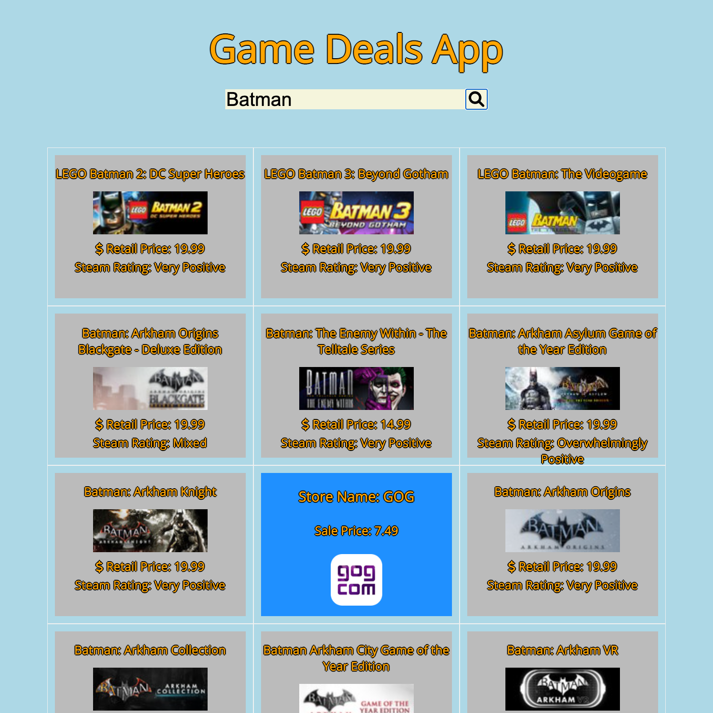

# Game Sale Deals App

---
### Summary

| Project Name  | Game Sale Deals
|----------------|------------------|
| Description   | This app searches a game currently listed on "Steam" and gives the user the cheapest price for the game and which online store has the current deal
| Developers | Nathan Yi|
| Live Website | https://www.game-sale-deals.netlify.app|
| Repo | https://www.github.com/yinathan/game-deals-app|

---

### Technologies Used
+ HTML5
+ CSS3
+ JavaScript
+ jQuery
+ Google Fonts
+ CheapShark API

---

### Screenshots

---

### Getting Started

[Click here](https://www.game-sale-deals.netlify.app) to search for deals on your favorite games now!
Type in the name of a game on steam and hover over the box to show which store has a lower price for that game and how much they sell it for! 
Happy saving!

### Future Enhancements

I hope to add a wider range of stores to search for, which will increase how many games the user is able to search for. Also, currently the search function will run the API many times (depending on how many games are searched) and will eventually give the user a CORS error. The timer on this is usually around 60 minutes and the user will be able to search again. 